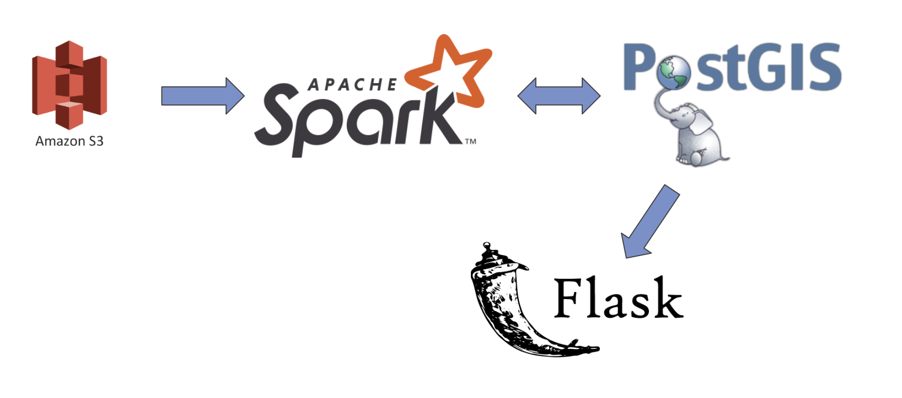

#  Trek Weather

A pipeline for joining historical weather data with a crowd-sourced list of hikes in the United States, built while a Data Engineering Fellow at Insight Data Science in Fall 2019.

## Project description

When it comes to planning a hike, weather conditions can influence the supplies and equipment you need. Trek Weather allows the user to view weather statistics (average/high/low temp, preciptation, snowfall) by route.

## The data

Data is compiled from NOAA's [Global Historical Climate Network](https://docs.opendata.aws/noaa-ghcn-pds/readme.html) and [OpenStreetMap](https://docs.opendata.aws/osm-pds/readme.html). Before entering the pipeline, the OpenStreetMap data was filtered for things coded as "route=hiking" and then ways and relations were collapsed to a single GPS location using [osmconvert](https://wiki.openstreetmap.org/wiki/Osmconvert) and [osmfilter](https://wiki.openstreetmap.org/wiki/Osmfilter).

## Tech Stack

For information about the processing in Spark and the database, see the [batch README](Batch/README.md). For information about the webapp in Flask, see the [webapp README](WebApp/README.md).

## Links

* [Project demo](bit.ly/trekWeather)

* [Presentation Slides](bit.ly/trekWeather_slides)